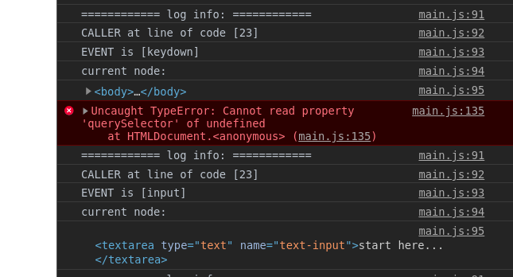
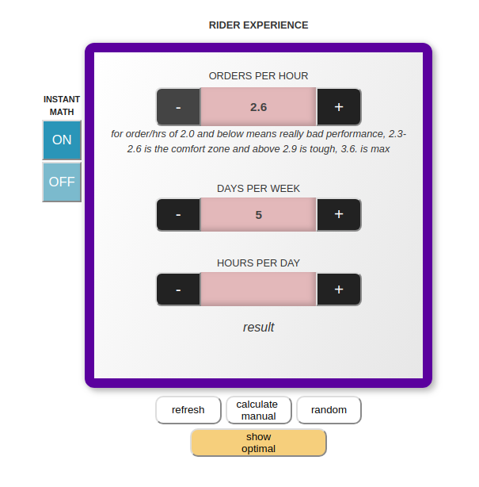

###long story short
>an easy to implement package, that helps you in to debug, when there is no code error but **logical** issues  
>logs you in runtime what is happening, where and **why**  
>for every action you get the event happened, node is targeted, what scope of code was called  
>although, side and **hidden** effects, to prevent memory/performance issues  
>
>it could be a bit messy but more useful
>
>any time you can stop the handler through [some command] _(TBA)_

>- _some instructions (TBA_)

###_a bit longer_
### what?

>ok, we could have issues when there is no idea what is happening to your app, but definitely not what was wanted
>
>code is fine, DOM is fine, there is no error you can check, but
>
>you know, **logical issues**
>
>something is processed by a client in other way, than expected; small event that happens 0,001% of time can destroy the app flow
>
>and so on

### but why...

>let start from own mistakes
>
>a long ago it was one small calc to sum an expected salary, based on user inputs

>the first no-error-but-logic-issue was that buttons "+" and "-" _simulate_ toggling - change the input until user release the button
>
>really there is was no toggling, only recursive _setTimeout_ on _mousedown_ event, that should be stopped on _mouseup_
> 
>but if a user pressed more than one button, _setTimeout_ never stops
> 

>the reason - I didn't expect that events works as: **happen** all _mousedown_, then all _mouseup_ 
>
>instead of _mousedown-mouseup-mousedown-mouseup_ 
> 
>it's noobish, I know, but exactly our case - no error to find, just a way of browser's logic - so, it was harder to find **why** it happened
> 
>to be honest, the next step I'm proud a bit - silly simple line of code - to log the current node element is involved
> 
> **what, of course, didn't help at all**
>
>the problem was events, not elements, but it gave me an idea - at runtime to dive, what and in what sequence exactly is happening

_this pic will be replaced_

>the gif above other case but the same issue and how important it could be
> 
> the app changes buttons "+" and "-" to "max" and "min", when user reaches the max/min in input - for better UX
> 
> by changing _textContent_ of current <_button_> considering the  _textContent_ of <_input_> through _Node.next/previousSibling_ <_button_>
> 
> I guess it's obvious, what happens after messing up with _mousedown_/_mouseup_ sequence
>
> &nbsp; 
> btw, other **important** stuff, that - remember the infinitive _setTimeout_ - **you couldn't see it, but it still eat your memory**
### to-do
>find a way to get what code is called
>
>maybe it can be created a new Error obj, that recognizes everything as an error, that log error.line, will see it
>

